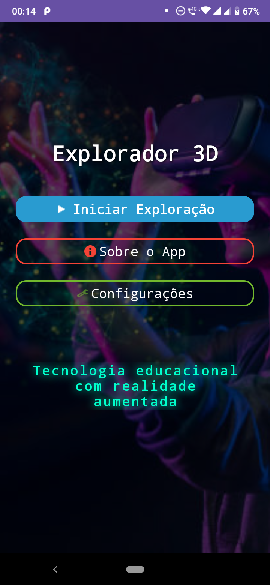
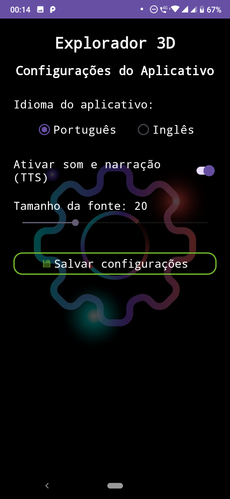
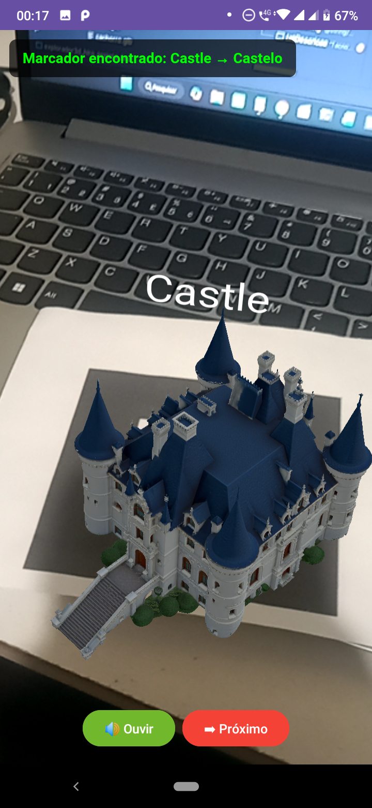
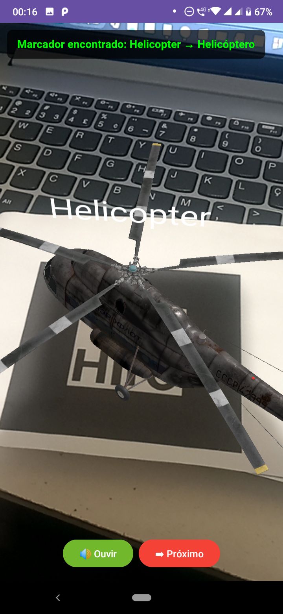
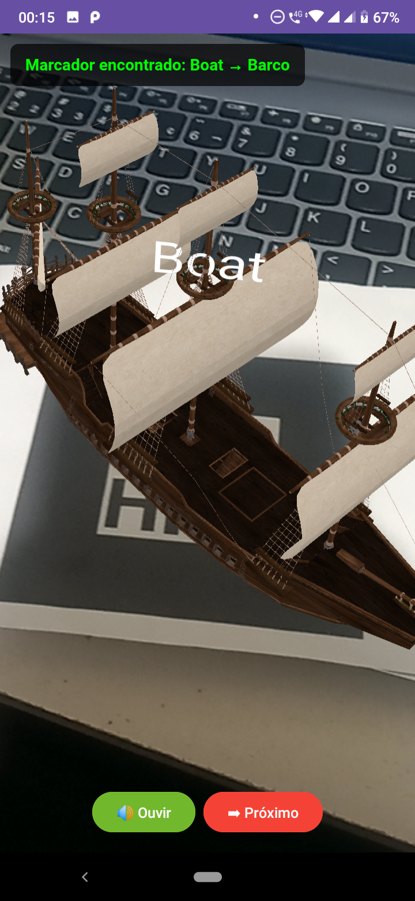

# 🌐 Explorador 3D

**Ferramenta educacional em Realidade Aumentada para o ensino de inglês para crianças do ensino fundamental.**

Trabalho de Conclusão de Curso (TCC) apresentado como requisito parcial para obtenção do título de Bacharel em Engenharia de Software na **Universidade Estadual de Ponta Grossa (UEPG)**.

<p align="center">
  
  
  
  
  
</p>

---

## 📖 Sobre o Projeto

O **Explorador 3D** é um aplicativo Android que utiliza **Realidade Aumentada (RA)** baseada em marcadores fiduciais (**HIRO**) para apresentar modelos tridimensionais, imagens e vídeos educativos de forma interativa e imersiva.

O usuário aponta a câmera do celular para um marcador HIRO impresso em papel, e o aplicativo sobrepõe conteúdo digital diretamente sobre ele. Ao reconhecer o marcador, o app executa **três ações simultâneas**:

1. 🎨 **Renderização visual** de um modelo 3D (estático ou animado) sobre o marcador;
2. 📝 **Exibição do nome do objeto** em português ou inglês;
3. 🔊 **Narração por síntese de voz (TTS)**, auxiliando na pronúncia correta da palavra.

O projeto é fundamentado em estudos como o de Kurnia et al. (2025), que apontam que o uso de RA no ensino de vocabulário apresenta **melhor desempenho em relação ao método tradicional**, uma vez que a combinação de estímulos visuais e auditivos aumenta a motivação e a memorização.

---

## 🎯 Objetivos

### Objetivo Geral
Desenvolver uma proposta de ensino da língua inglesa para crianças do ensino fundamental utilizando Realidade Aumentada.

### Objetivos Específicos
- Investigar o uso da RA no contexto educacional, com foco no ensino de língua inglesa;
- Identificar limitações dos métodos tradicionais e possibilidades de integração com tecnologias digitais;
- Desenvolver objetos tridimensionais no **Blender** para representação de vocabulário em inglês;
- Implementar um aplicativo mobile no Android Studio capaz de reconhecer marcadores visuais HIRO;
- Integrar recursos de áudio (TTS) associando pronúncia aos objetos;
- Avaliar o potencial da solução em termos de engajamento e apoio à aprendizagem.

---

## ✨ Funcionalidades

- 🌐 **RA com marcadores HIRO** — reconhecimento em tempo real via AR.js + JSARToolKit
- 🧊 **Modelos 3D em GLB** — 10+ modelos (avião, carro, castelo, dinossauro, navio, helicóptero, xadrez, sistema solar, etc.)
- 🖼️ **Imagens educativas em RA** — com frases descritivas em inglês
- 🎥 **Vídeo AR introdutório** sobre a tecnologia
- 🔊 **Text-to-Speech (TTS)** — narração offline via API nativa do Android (`android.speech.tts`)
- 🌎 **Tradução automática** — API MyMemory (EN → PT-BR) via Retrofit2
- ⚙️ **Configurações persistentes** — idioma (PT/EN), som on/off, tamanho de fonte (SharedPreferences)
- 📱 **Funcionamento offline** — modelos e bibliotecas embarcados no APK

---

## 🛠️ Tecnologias Utilizadas

### Camada Nativa (Android)
| Tecnologia | Função |
|------------|--------|
| **Kotlin** | Linguagem principal do app |
| **Android Studio** | IDE de desenvolvimento |
| **Material Design 3** | Componentes visuais (botões, switches, sliders) |
| **SharedPreferences** | Persistência de configurações do usuário |
| **TextToSpeech API** | Síntese de voz offline |
| **WebView + WebViewAssetLoader** | Contexto seguro HTTPS para a câmera |
| **Retrofit2 + Gson** | Chamadas HTTP para a API de tradução |
| **OkHttp** | Cliente HTTP subjacente + logging |
| **Gradle KTS** | Sistema de build (Kotlin DSL) |

### Camada de Realidade Aumentada (Web)
| Tecnologia | Função |
|------------|--------|
| **HTML5 + CSS3 + JavaScript** | Estrutura da cena AR |
| **A-Frame 1.7** | Framework declarativo para 3D/RA |
| **AR.js** | Rastreamento de marcadores HIRO |
| **JSARToolKit** | Detecção e cálculo de pose (port do ARToolKit) |

### APIs e Recursos Externos
| Serviço | Uso |
|---------|-----|
| **MyMemory Translation API** | Tradução automática EN → PT-BR |
| **Sketchfab** | Repositório de modelos 3D livres (formato GLB) |
| **Blender** | Ajuste e exportação de modelos 3D |

---

## 🏗️ Arquitetura

O projeto adota uma **arquitetura híbrida**, dividida em duas camadas que interagem entre si:

```
┌─────────────────────────────────────────────┐
│         CAMADA NATIVA (Kotlin/Android)      │
│  ┌──────────────────────────────────────┐   │
│  │  Activities, AppConfig, TTS, Retrofit│   │
│  └──────────────────────────────────────┘   │
│                     ↕                        │
│         WebView (WebViewAssetLoader)         │
│                     ↕                        │
│  ┌──────────────────────────────────────┐   │
│  │   CAMADA DE RA (HTML + A-Frame + AR.js)│ │
│  │   Marcadores HIRO, modelos GLB       │   │
│  └──────────────────────────────────────┘   │
└─────────────────────────────────────────────┘
```

### Por que arquitetura híbrida?

Não existe SDK nativo para Kotlin/Android que suporte marcadores fiduciais HIRO. Bibliotecas como o **ARCore (Google)** não implementam marcadores no estilo ARToolKit. A solução adotada foi encapsular **A-Frame + AR.js** em um **WebView** configurado como **contexto seguro HTTPS** (via `WebViewAssetLoader`), permitindo o acesso à câmera.

---

## 📂 Estrutura do Projeto

```
explorador3d_hiro_projeto_final/
├── app/
│   ├── src/main/
│   │   ├── java/com/example/explorador3d_hiro_projeto_final/
│   │   │   ├── MainActivity.kt              # Tela inicial
│   │   │   ├── ExploracaoActivity.kt        # Menu de modos (3D/Imagens/Vídeos)
│   │   │   ├── VisualizadorActivity.kt      # RA com modelos 3D
│   │   │   ├── ImagensActivity.kt           # RA com imagens educativas
│   │   │   ├── VisualizadorVideosActivity.kt# Vídeo AR introdutório
│   │   │   ├── ConfiguracoesActivity.kt     # Preferências (idioma, som, fonte)
│   │   │   ├── SobreActivity.kt             # Sobre o projeto
│   │   │   ├── api/
│   │   │   │   └── LibreTranslateRepository.kt  # Cliente MyMemory (Retrofit)
│   │   │   └── utils/
│   │   │       └── AppConfig.kt             # Singleton de configurações
│   │   ├── assets/
│   │   │   ├── index.html                   # Cena A-Frame
│   │   │   ├── js/
│   │   │   │   ├── aframe.min.js
│   │   │   │   └── aframe-ar.js
│   │   │   ├── modelos/                     # Modelos .glb (Sketchfab)
│   │   │   ├── imagens/                     # Imagens educativas
│   │   │   └── videos/                      # Vídeo introdutório
│   │   ├── res/
│   │   │   ├── layout/                      # Layouts XML
│   │   │   └── values/                      # Cores, strings, temas
│   │   └── AndroidManifest.xml              # Permissões e Activities
│   └── build.gradle.kts
├── build.gradle.kts
├── settings.gradle.kts
└── README.md
```

### Permissões declaradas no AndroidManifest.xml

| Permissão | Finalidade |
|-----------|-----------|
| `CAMERA` | Acesso à câmera traseira para RA |
| `RECORD_AUDIO` | Contexto multimídia do WebView |
| `MODIFY_AUDIO_SETTINGS` | Ajuste de áudio para o TTS |
| `INTERNET` | Chamadas à API MyMemory |

Atributos globais: `hardwareAccelerated="true"`, `usesCleartextTraffic="true"`, `screenOrientation="portrait"`.

---

## 🔬 Como funciona a Realidade Aumentada

### Pipeline de rastreamento (por frame)

1. **Conversão para escala de cinza** — reduz carga computacional
2. **Limiarização (thresholding)** — separa bordas escuras de áreas claras
3. **Detecção de contornos quadrados** — busca quadriláteros no frame
4. **Comparação com padrão `.patt` (HIRO)** — cálculo de similaridade
5. **Cálculo de pose (homografia)** — estima translação e rotação do marcador no espaço 3D

### Suavização do rastreamento

Para eliminar o tremor (*jitter*) característico do rastreamento por marcadores:

```html
<a-marker preset="hiro" smooth="true" smoothCount="5" smoothTolerance="0.01">
```

Um **filtro de média móvel** sobre as últimas 5 posições detectadas garante estabilidade visual.

### Troca dinâmica de modelos

Sem recarregar a página, o app injeta JavaScript via `evaluateJavascript()`:

```kotlin
val js = """
    var entity = document.querySelector('#modelo3d');
    entity.removeAttribute('gltf-model');
    entity.setAttribute('gltf-model', 'modelos/carro.glb');
    entity.setAttribute('scale', '0.2 0.2 0.2');
""".trimIndent()
webView.evaluateJavascript(js, null)
```

Cada modelo tem **escala individual calibrada** (pois os GLBs vêm de fontes com unidades diferentes).

---

## 🗄️ Banco de Dados / Persistência

O app utiliza **SharedPreferences** (`config_app`) para armazenar três valores:

| Chave | Tipo | Padrão | Descrição |
|-------|------|--------|-----------|
| `idioma` | String | `"pt"` | Idioma da interface (`pt` / `en`) |
| `som` | Boolean | `true` | TTS ativo/inativo |
| `tamanho_fonte` | Int | `20` | Tamanho da fonte (12–40 sp) |

A lógica é centralizada no singleton **`AppConfig`** (`utils/AppConfig.kt`).

---

## ▶️ Como Compilar e Executar

### Pré-requisitos

- **Android Studio** (versão recente — Ladybug ou superior)
- **JDK 17+**
- **Android SDK 36** (compileSdk)
- Dispositivo físico Android 7.0+ (**minSdk 24**) com câmera
- **Marcador HIRO impresso** em papel A4

### Passos

1. **Clone o repositório:**
   ```bash
   git clone https://github.com/micheldelima/explorador3d-tcc.git
   cd explorador3d-tcc
   ```

2. **Abra no Android Studio:**
   - File → Open → selecione a pasta do projeto
   - Aguarde a sincronização do Gradle

3. **Conecte um dispositivo físico** (o emulador não suporta câmera real para RA)

4. **Execute:**
   - Clique em **Run** (▶) ou pressione `Shift + F10`

5. **Imprima o marcador HIRO:**
   - [Baixar marcador HIRO (PDF)](https://github.com/micheldelima/explorador3d-tcc/blob/main/app/src/main/assets/hiro.patt) — ou pesquise "HIRO marker AR.js"
   - Imprima em papel A4, sem redimensionar

6. **Use o app:**
   - Abra → **Iniciar Exploração** → **Modelos 3D**
   - Aponte a câmera para o marcador HIRO
   - O modelo 3D aparecerá sobre o marcador
   - Toque em **Ouvir** para ouvir a pronúncia
   - Toque em **Próximo** para trocar de modelo

### Gerar APK

```bash
./gradlew assembleRelease
```

O APK será gerado em `app/build/outputs/apk/release/`.

---

## 🎮 Como Usar

| Ação | Resultado |
|------|-----------|
| Apontar a câmera para o marcador | Exibe o modelo 3D sobre ele |
| Pressionar **Ouvir** | Reproduz a frase em inglês via TTS ("*This is an airplane*") |
| Pressionar **Próximo** | Troca o modelo (avião → livro → carro → ...) |
| Tela **Configurações** | Ajusta idioma (PT/EN), som e tamanho da fonte |
| Tela **Sobre** | Informações do projeto |

---

## 📊 Avaliação

O projeto foi avaliado por **8 participantes anônimos** (majoritariamente estudantes, 8–25 anos).

| Critério | Resultado |
|----------|-----------|
| 🧊 Renderização de modelos 3D | ⭐ 100% de aprovação total |
| 🎨 Interface intuitiva | 87,5% concordaram |
| 📚 Eficácia pedagógica percebida | 87,5% concordaram |
| ⚙️ Painel de configurações | 75% concordaram |
| 🔊 Qualidade do áudio (TTS) | 75% concordaram — **ponto de melhoria futura** |

**Conclusão da avaliação:** o app cumpre seu objetivo de forma estável e é percebido como eficaz para o ensino de inglês, com oportunidade de melhoria na clareza/volume do áudio.

---

## 🚀 Trabalhos Futuros

- Explorar bibliotecas para habilidades linguísticas mais complexas (produção oral e escrita)
- Ampliar a base de modelos 3D para maior diversidade temática
- Melhorar a qualidade e clareza do áudio TTS
- Aplicar a mesma arquitetura ao ensino de outros idiomas (francês, espanhol, mandarim, alemão)
- Testes em ambiente escolar com turmas maiores

---

## 👥 Autores

| Nome | Função |
|------|--------|
| **Michel de Lima** | Desenvolvimento principal do app |
| **André Pereira Justiniano** | Co-autoria |
| **Gustavo Ribeiro Gomes** | Co-autoria |

**Orientadora:** Profa. Gabrielly Queiróz Pereira
**Instituição:** Universidade Estadual de Ponta Grossa (UEPG) — Departamento de Informática
**Curso:** Bacharelado em Engenharia de Software
**Ano:** 2026

---

## 📚 Referências Principais

- **KURNIA, I. et al.** The effectiveness of augmented reality in teaching english vocabulary to seventh-grade students. *Journal of Innovation in Teaching and Instructional Media*, v. 6, n. 1, 2025.
- **KREWER, E. et al.** Aplicativo RAL: Realidade Aumentada (RA) no ensino e aprendizagem de línguas adicionais. *Entretextos*, Londrina, v. 22, 2022.
- **PARLAR, B.; SÜTÇÜ, S. S.** The effects of augmented reality in situated english language learning. *Journal of Computer Assisted Learning*, v. 41, 2025.
- **FERREIRA, M. C.; RIBEIRO, P. A. N. S.** A realidade aumentada no ensino e aprendizagem de vocabulário em língua inglesa. *Trabalhos em Linguística Aplicada*, v. 63, n. 3, 2024.
- **ARAÚJO, A. S.; SORTE, P. B.** Língua inglesa na escola pública: aplicativos de realidade aumentada e práticas sociais de linguagem. *Revista de Estudos de Cultura*, v. 10, n. 25, 2024.
- **OLIVEIRA, L. et al.** MondlyAR: Uso da realidade aumentada como recurso facilitador da aprendizagem de língua inglesa. *Revista Tecnologias Educacionais em Rede*, v. 5, n. 1, 2024.

---

## 📄 Licença

Projeto acadêmico desenvolvido para fins educacionais e de pesquisa. Modelos 3D obtidos no Sketchfab sob licenças de uso livre.

---

<p align="center">
  <strong>Universidade Estadual de Ponta Grossa — UEPG</strong><br>
  Bacharelado em Engenharia de Software — 2026
</p>
